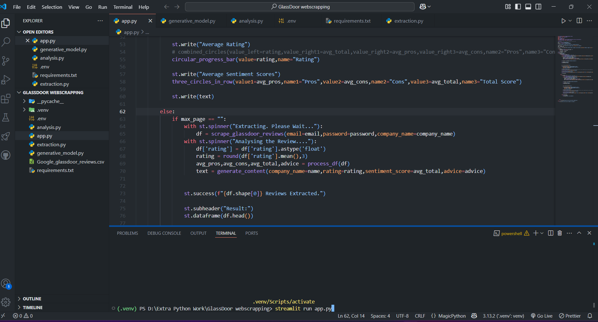

# Glassdoor Company Reviews Sentiment Analysis

## Overview
This is a web application built with Streamlit that performs web scraping and sentiment analysis on Glassdoor reviews of a specified company. The app uses Selenium to extract reviews, VaderSentiment for sentiment analysis, and Google Gemini 1.5 Flash via LangChain to generate insights and recommendations.

## Features
- **User Input:**
  - Company name
  - Number of pages to scrape (optional, default is 5)
- **Data Extraction:**
  - Opens a new window, navigates to Glassdoor, searches for the company, and extracts reviews (title, date, pros, cons, and advice)
  - Extracted reviews are stored in a Pandas DataFrame
  - Displays the first 5 records in the Streamlit app
  - Provides a button to download the entire dataset
- **Sentiment Analysis:**
  - Preprocesses the extracted data
  - Computes sentiment scores for pros, cons, and combined (pros-cons) using VaderSentiment
  - Displays sentiment scores using circular charts
- **AI-Powered Insights:**
  - Uses Google Gemini 1.5 Flash (via LangChain) to generate an overall observation of the company’s reviews and recommendations
  - Displays the AI-generated insights

## Installation
### Prerequisites
Ensure you have the following installed:
- Python 3.8+
- Google Chrome
- Chrome WebDriver (compatible with your Chrome version)
- Required Python libraries:
  ```sh
  pip install streamlit selenium pandas numpy vaderSentiment langchain webdriver-manager python-dotenv langchain-google-genai nltk chromedriver-autoinstaller
  ```

## Usage
### 1. Run the Application
```sh
streamlit run app.py
```

### 2. Enter Company Details
- Enter the **company name**
- Specify the number of pages to extract (optional)
- Click the **Extract** button

### 3. Data Extraction Process
- A new window opens, navigates to Glassdoor, searches for the company, and extracts reviews
- The window automatically closes after extraction
- The first 5 reviews are displayed in the Streamlit app
- A **Download Dataset** button is available

### 4. Sentiment Analysis
- The sentiment scores (pros, cons, combined) are calculated
- Results are displayed in circular charts

### 5. AI-Generated Insights
- Google Gemini 1.5 Flash generates an overview of the company's reviews
- Recommendations based on extracted insights are displayed


## Future Improvements
- Enhance scraping efficiency and bypass bot detection mechanisms
- Expand sentiment analysis with additional models
- Improve UI/UX of the Streamlit app

## License
This project is licensed under the MIT License.

---
**Contributors:** [Your Name]


