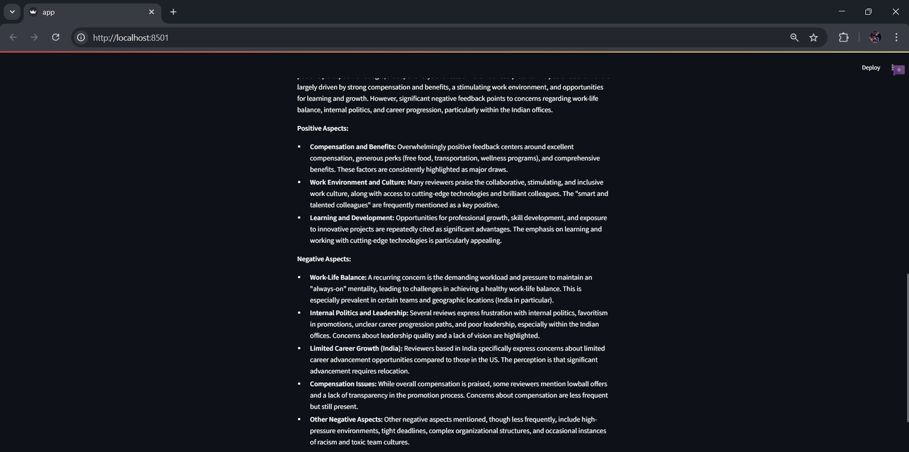

# Glassdoor Company Reviews Sentiment Analysis

## Overview
This is a web application built with Streamlit that performs web scraping and sentiment analysis on Glassdoor reviews of a specified company. The app uses Selenium to extract reviews, VaderSentiment for sentiment analysis, and Google Gemini 1.5 Flash via LangChain to generate insights and recommendations.

## Features
- Web scraping of company reviews from Glassdoor using Selenium.
- Sentiment analysis of extracted reviews using VaderSentiment.
- AI-generated insights and recommendations using Google Gemini 1.5 Flash.
- Interactive visualization of sentiment scores.
- Download option for the extracted dataset.

## Installation
### Prerequisites
Ensure you have the following installed:
- Python 3.8+
- Google Chrome
- Chrome WebDriver (compatible with your Chrome version)
- Required Python libraries:
  ```sh
  pip install streamlit selenium pandas numpy vaderSentiment langchain google-generativeai
  ```

## Step-by-Step Process

### 1. Start the Application
Run the following command in your terminal:
```sh
streamlit run app.py
```

### 2. Enter Company Details
- Enter the **company name** in the input field.
- (Optional) Specify the number of pages to extract (default is 5 pages).
- Click the **Extract** button.
  


### 3. Data Extraction Process
- A new browser window opens automatically.
- The application navigates to Glassdoor, searches for the specified company, and clicks on the company name.
- The browser moves to the **Reviews** section and extracts the following details:
  - **Title** of the review
  - **Date** of the review
  - **Pros** mentioned by employees
  - **Cons** mentioned by employees
  - **Advice to Management**
- The extraction continues until the specified number of pages is reached.
- Login
  
  
- Search
  
  
- Company Profile
  
  
- Review Extraction
  
  
- After completion, the browser window **automatically closes**.
- The first 5 records of the extracted dataset are displayed in the Streamlit app.
- A **Download Dataset** button is provided to download the full dataset.
  


### 4. Sentiment Analysis
- The extracted reviews are **preprocessed**.
- Sentiment scores are calculated using **VaderSentiment**:
  - **Pros Sentiment Score**
  - **Cons Sentiment Score**
  - **Combined Score (Pros - Cons)**
- Sentiment scores are displayed in circular charts.
  


### 5. AI-Generated Insights & Recommendations
- The application provides the extracted **company name, sentiment scores, pros, cons, and advice** as input to **Google Gemini 1.5 Flash** via **LangChain**.
- The AI model generates:
  - An **overall observation** of the company’s reviews.
  - **Recommendations** based on the extracted insights.
- The results are displayed in the Streamlit app.




## Future Improvements
- Enhance scraping efficiency and bypass bot detection mechanisms.
- Expand sentiment analysis with additional models.
- Improve UI/UX of the Streamlit app.

## License
This project is licensed under the MIT License.

---
**Contributors:** [Nikhil Vinod]

